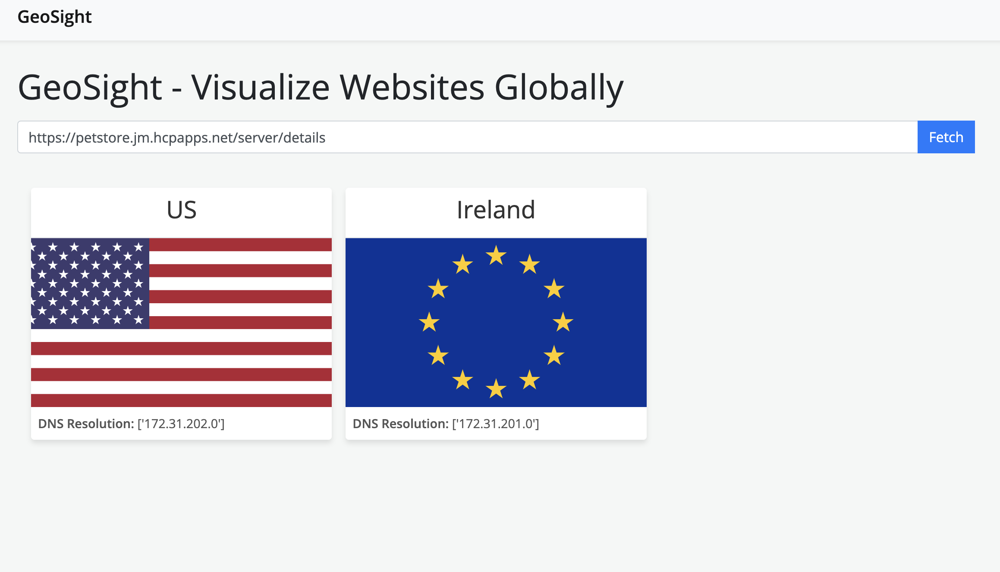

# API Quickstart

## Introduction

This document details how to setup a local reference architecture, and design and deploy an API. This will show the following API management features in a kube native environment using Kuadrant and other open source tools:

- API design
- API security and access control
- API monitoring
- Traffic management and scalability

The sections in this document are grouped by the persona that is typically associated with the steps in that section. The 3 personas are:

- The *platform engineer*, who provides and maintains a platform for application developers,
- the *application developer*, who designs, builds and maintains applications and APIs,
- and the *api consumer*, who makes API calls to the API

## Pre-requisities

- `docker`: https://www.docker.com/products/docker-desktop/
- `kubectl`: https://kubernetes.io/docs/reference/kubectl/
- `kustomize`: https://kustomize.io/
- `helm`: https://helm.sh/docs/intro/install/
- `operator-sdk`: https://sdk.operatorframework.io/docs/installation/
- An [AWS account](https://aws.amazon.com/) with a Secret Access Key and Access Key ID. You will also need to a [Route 53](https://docs.aws.amazon.com/route53/) zone.

## (Platform engineer) Platform Setup

Export the following env vars:

```bash
export KUADRANT_AWS_ACCESS_KEY_ID=<key_id>
export KUADRANT_AWS_SECRET_ACCESS_KEY=<secret>
export KUADRANT_AWS_REGION=<region>
export KUADRANT_AWS_DNS_PUBLIC_ZONE_ID=<zone>
export KUADRANT_ZONE_ROOT_DOMAIN=<domain>
```

Clone the api-quickstart repo and run the quickstart script:

```bash
git clone git@github.com:Kuadrant/api-quickstart.git && cd api-quickstart
./quickstart.sh
```

This will take several minutes as 3 local kind clusters are started and configured in a hub and spoke architecture.
The following components will be installed on the clusters:

- Hub
  - [Open Cluster Management](https://open-cluster-management.io/), as a 'hub' cluster
  - [Kuadrant Multi Cluster Gateway Controller](https://docs.kuadrant.io/multicluster-gateway-controller/), for managing a Gateway in multiple clusters centrally
  - [Gatekeeper](https://github.com/open-policy-agent/gatekeeper), for constraints on Gateway Policy requirements
  - [Thanos](https://github.com/thanos-io/thanos), for receiving metrics centrally
  - [Grafana](https://github.com/grafana/grafana), for visualising API & Gateway metrics
- Spoke x2
  - [Open Cluster Management](https://open-cluster-management.io/), as a 'spoke' cluster
  - [Kuadrant Operator](https://docs.kuadrant.io/kuadrant-operator/), for auth and rate limiting policies attached to a HTTPRoute
  - [Istio](https://istio.io/latest/docs/), with the Gateway API CRDs as the Gateway for ingress trafic
  - [MetalLB](https://metallb.universe.tf/), for exposing the Gateway service on the local network
  - [Prometheus](https://prometheus.io/), for scraping and federating metrics to the hub

### Verify the Gateway and configuration

View the ManagedZone, Gateway and TLSPolicy. The ManagedZone and TLSPolicy should have a Ready status of true. The Gateway should have a Programmed status of True.

```bash
kubectl --context kind-api-control-plane get managedzone,tlspolicy,gateway -n multi-cluster-gateways
```

### Guard Rails: Constraint warnings about missing policies ( DNS, TLS)

Running the quick start script above will bring up [Gatekeeper](https://open-policy-agent.github.io/gatekeeper/website/docs) and the following constraints: 

* Gateways must have a TLSPolicy targeting them
* Gateways must have a DNSPolicy targeting them

To view the above constraints in kubernetes, run this command:
```bash
kubectl --context kind-api-control-plane get constraints
```

**Note:** :exclamation: Since a gateway has been created automatically, along with a TLSPolicy, the violation for a missing DNSPolicy will be active until one is created.

### Grafana dashboard view

To get a top level view of the constraints in violation, the `Stitch: Platform Engineer Dashboard` can be used. This can be accessed by at [https://grafana.172.31.0.2.nip.io](https://grafana.172.31.0.2.nip.io)

Grafana has a default username and password of `admin`.
You can find the `Stitch: Platform Engineer Dashboard` dashboard in the `Default` folder.

### Create the missing DNSPolicy

Create a DNSPolicy that targets the Gateway with the following command:

```bash
kubectl --context kind-api-control-plane apply -f - <<EOF
apiVersion: kuadrant.io/v1alpha1
kind: DNSPolicy
metadata:
  name: prod-web
  namespace: multi-cluster-gateways
spec:
  targetRef:
    name: prod-web
    group: gateway.networking.k8s.io
    kind: Gateway
  loadBalancing:
    geo:
      defaultGeo: EU
EOF
```

### Platform Overview

Since we have created all the policies that Gatekeeper had the guardrails around, you should no longer see any constraints in violation. This can be seen back in the `Stitch: Platform Engineer Dashboard` in Grafana at [https://grafana.172.31.0.2.nip.io](https://grafana.172.31.0.2.nip.io)

## (Application developer) App setup

### API Design

[Fork](https://github.com/Kuadrant/api-petstore/fork) and/or clone the Petstore App at https://github.com/Kuadrant/api-petstore

```bash
git clone git@github.com:kuadrant/api-petstore && cd api-petstore
# Or if you forked the repository:
# git clone git@github.com:<your_github_username>/api-petstore && cd api-petstore
```

Then deploy it to the first workload cluster:

```bash
kustomize build ./resources/ | envsubst | kubectl --context kind-api-workload-1 apply -f-
```

This will deploy:

* A `petstore` Namespace
* A `Secret`, containing a static API key that we'll use later for auth
* A `Service` and `Deployment` for our petstore app
* A Gateway API `HTTPRoute` for our petstore app

#### Route 53 DNS Zone

When the DNS Policy has been created, and the previously created `HTTPRoute` has been attached, a DNS record custom resource will also be created in the cluster resulting in records being created in your AWS Route53. Navigate to Route53 and you should see some new records in the zone.

### Configuring the region label

Configure the app `REGION` to be `eu`:

```bash
kubectl --context kind-api-workload-1 apply -k ./resources/eu-cluster/
```

### Exploring the Open API Specification

The raw Open API spec can be found in the root of the repo:

```bash
cat openapi.yaml
# ---
# openapi: 3.0.2
# info:
#   title: Stitch API Petstore
#   version: 1.0.18
```

## (Application developer) API security

We've included a number of sample `x-kuadrant` extensions in the OAS spec already:

- At the top-level of our spec, we've defined an `x-kuadrant` extension to detail the Gateway API Gateway associated with our app:

```yaml
  x-kuadrant:
    route:
      name: petstore
      namespace: petstore
      labels:
        deployment: petstore
        owner: cferreir
      hostnames:
      - petstore.$KUADRANT_ZONE_ROOT_DOMAIN
      parentRefs:
      - name: prod-web
        namespace: kuadrant-multi-cluster-gateways
        kind: Gateway
```

- In `/user/login`, we have a Gateway API `backendRef` set and a `rate_limit` set. The rate limit policy for this endpoint restricts usage of this endpoint to 2 requests in a 10 second window:
    ```yaml
    x-kuadrant:
      backendRefs:
      - name: petstore
        namespace: petstore
        port: 8080
      rate_limit:
      rates:
      - limit: 2
        duration: 10
        unit: second
    ```
- In `/store/inventory`, we have also have a Gateway API `backendRef`set and a `rate_limit` set. The rate limit policy for the endpoint restricts usage of this endpoint to 10 requests in a 10 second window:
    ```yaml
    x-kuadrant:
      backendRefs:
      - name: petstore
        namespace: petstore
        port: 8080
      rate_limit:
        rates:
        - limit: 10
          duration: 10
          unit: second
    ```
- Finally, we have a `securityScheme` setup for apiKey auth, powered by Authorino. We'll show this in more detail a little later:
  ```yaml
  securitySchemes:
    api_key:
      type: apiKey
      name: api_key
      in: header
  ```

These extensions allow us to automatically generate Kuadrant Kubernetes resources, including [AuthPolicies](https://docs.kuadrant.io/kuadrant-operator/doc/auth/), [RateLimitPolicies](https://docs.kuadrant.io/kuadrant-operator/doc/rate-limiting/) and [Gateway API resources](https://gateway-api.sigs.k8s.io/reference/spec/) such as HTTPRoutes.

### kuadrantctl

`kuadrantctl` is a cli that supports the generation of various Kubernetes resources via OAS specs.
Let's run some commands to generate some of these resources.
If you forked the api-pestore repo, you can check them in also.
Let's apply these to our running workload to implement rate limiting and auth.

### Installing `kuadrantctl`
Download `kuadrantctl` from the `v0.2.0` release artifacts:

https://github.com/Kuadrant/kuadrantctl/releases/tag/v0.2.0

Drop the `kuadrantctl` binary somewhere into your $PATH (e.g. `/usr/local/bin/`).

For this next part of the tutorial, we recommend installing [`yq`](https://github.com/mikefarah/yq) to pretty-print YAML resources.

### Generating Kuadrant resources with `kuadrantctl`

We'll generate an `AuthPolicy` to implement API key auth, per the `securityScheme` in our OAS spec:

```bash
# Generate this resource and save:
kuadrantctl generate kuadrant authpolicy --oas openapi.yaml | yq -P | tee resources/authpolicy.yaml

# Apply this resource to our cluster:
kubectl --context kind-api-workload-1 apply -f ./resources/authpolicy.yaml
```

Next we'll generate a `RateLimitPolicy`, to protect our APIs with the limits we have setup in our OAS spec:

```bash
# Generate this resource and save:
kuadrantctl generate kuadrant ratelimitpolicy --oas openapi.yaml | yq -P | tee resources/ratelimitpolicy.yaml

# Apply this resource to our cluster:
kubectl --context kind-api-workload-1 apply -f ./resources/ratelimitpolicy.yaml
```

Lastly, we'll generate a Gateway API `HTTPRoute` to service our APIs:

```bash
# Generate this resource and save:
kuadrantctl generate gatewayapi httproute --oas openapi.yaml | yq -P | tee resources/httproute.yaml

# Apply this resource to our cluster, setting the hostname in via the KUADRANT_ZONE_ROOT_DOMAIN env var:
kustomize build ./resources/ | envsubst | kubectl --context kind-api-workload-1 apply -f-
```

### Check our applied policies

Navigate to your app's Swagger UI:

```bash
echo https://petstore.$KUADRANT_ZONE_ROOT_DOMAIN/docs/
```

#### RateLimitPolicy

Let's check that our `RateLimitPolicy` for the `/store/inventory` has been applied and works correctly. Recall, our OAS spec had the following limits applied:

```yaml
x-kuadrant:
  ...
  rate_limit:
    rates:
    - limit: 10
      duration: 10
      unit: second
```
Navigate to the `/store/inventory` API, click `Try it out`, and `Execute`.

You'll see a response similar to:

```json
{
  "available": 10,
  "pending": 5,
  "sold": 3
}
```

This API has a rate limit applied, so if you send more than 10 requests in a 10 second window, you will see a `429` HTTP Status code from responses, and a "Too Many Requests" message in the response body. Click `Execute` quickly in succession to see your `RateLimitPolicy` in action.

#### AuthPolicy

Let's check that our `AuthPolicy` for the `/store/admin` endpoint has been applied and works correctly. Recall, our OAS spec had the following securitySchemes applied:

```yaml
  securitySchemes:
    api_key:
      type: apiKey
      name: api_key
      in: header
```

Navigate to the `/store/admin` API, click `Try it out`, and `Execute`.
You'll get a 401 response.

You can set a value for the `api_key` header by clicking `Authorize` at the top of the page. Set a value of `secret`.
This api key value is stored in the `petstore-api-key` Secret in the `petstore` namespace.
Try the `/store/admin` endpoint again and you should get a 200 response with the following:

```json
{"message":"You are an admin!"}
```

### Policy Adjustments

Run the Swagger UI editor to explore the OAS spec and make some tweaks:

```bash
docker run -p 8080:8080 -v $(pwd):/tmp -e SWAGGER_FILE=/tmp/openapi.yaml swaggerapi/swagger-editor
```

You should be able to access the Swagger Editor at [http://localhost:8080](http://localhost:8080).
Our `/store/inventory` API needs some additonal rate limiting. This is one of our slowest, most expensive services, so we'd like to rate limit it further.

In your `openapi.yaml`, navigate to the `/store/inventory` endpoint in the `paths` block. Modify the rate_limit block to further restrict the amount of requests this endpoint can serve to 2 requests per 10 seconds:

```yaml
x-kuadrant:
  ...
  rate_limit:
    rates:
    - limit: 2
      duration: 10
      unit: second
```

Save your updated spec - `File` > `Save as YAML` > and update your existing `openapi.yaml`. You may need to copy the file from your Downloads folder to the location of the petstore repository.

Next we'll re-generate our `RateLimitPolicy` with `kuadrantctl`:

```bash
# Generate this resource and save:
kuadrantctl generate kuadrant ratelimitpolicy --oas openapi.yaml | yq -P | tee resources/ratelimitpolicy.yaml

# Apply this resource to our cluster:
kubectl --context kind-api-workload-1 apply -f ./resources/ratelimitpolicy.yaml
```

At this stage you can optionally check in all the changes to the repo if you forked it.

```bash
# Optionally add, commit & push the changes to your fork
git add resources
git commit -am "Generated AuthPolicy,RateLimitPolicy & HTTPRoute"
git push # You may need to set an upstream as well
```

In your app's Swagger UI:

```bash
echo https://petstore.$KUADRANT_ZONE_ROOT_DOMAIN/docs/
```

Navigate to the `/store/inventory` API one more, click `Try it out`, and `Execute`.

You'll see the effects of our new `RateLimitPolicy` applied. If you now send more than 2 requests in a 10 second window, you'll be rate-limited.

**Note:** :exclamation: It may take a few minutes for the updated RateLimitPolicy to be configured with the modified rate limit.

## (Application developer) Scaling the application

Deploy the petstore to the 2nd cluster:

```bash
kustomize build ./resources/ | envsubst | kubectl --context kind-api-workload-2 apply -f-
```

Configure the app `REGION` to be `us`:

```bash
kubectl --context kind-api-workload-2 apply -k ./resources/us-cluster/
```

## (Platform engineer) Scaling the gateway and traffic management

Deploy the Gateway to the 2nd cluster:

```bash
kubectl --context kind-api-control-plane patch placement http-gateway --namespace multi-cluster-gateways --type='json' -p='[{"op": "replace", "path": "/spec/numberOfClusters", "value":2}]'
```

Label the 1st cluster as being in the 'EU' region,
and the 2nd cluster as being in the 'US' region.
These labels are used by the DNSPolicy for configuring geo DNS.

```bash
kubectl --context kind-api-control-plane label managedcluster kind-api-workload-1 kuadrant.io/lb-attribute-geo-code=EU --overwrite
kubectl --context kind-api-control-plane label managedcluster kind-api-workload-2 kuadrant.io/lb-attribute-geo-code=US --overwrite
```

## (API consumer) Accessing the API from multiple regions

> [!NOTE]  
> This section is **optional**. If you'd rather skip this part, you can skip forward to the "(App developer) API traffic monitoring" section.



### Pre-requisites

- `python3` and `pip3`: these are required for this part of the walkthrough

To demonstrate traffic management by geographical region, we'll use a tool called 'geosight'. This tool resolves hostnames from different regions, fetches a website from the resulting DNS record address and takes a screenshot. The petstore app has been configured to serve a flag image based on which region it is running in. In the 1st cluster, the EU flag is used. In the 2nd cluster, the US flag is used.

To install 'geosight', run the following commands:

```bash
git clone git@github.com:jasonmadigan/geosight.git && cd geosight
pip3 install -r requirements.txt
playwright install
```

Then run it using:

```bash
python3 app.py
```

Access the webapp at [http://127.0.0.1:5001/](http://127.0.0.1:5001/).
In the input box, type the address from below and click the `Fetch` button:

```bash
echo https://petstore.$KUADRANT_ZONE_ROOT_DOMAIN/server/details
```

After a moment you should see dns results for different regions, and a corresponding screenshot.

If you want to experiment with other regions, check out the [Configuration section](https://github.com/jasonmadigan/geosight?tab=readme-ov-file#configuration) for geosight and the [Kuadrant docs](https://docs.kuadrant.io/multicluster-gateway-controller/docs/how-to/multicluster-loadbalanced-dnspolicy/#configuring-cluster-geo-locations) for geo loadbalancing.

## (App developer) API traffic monitoring

To view the App developer dashboard, the same Grafana will be used from the platform engineer steps above:
`https://grafana.172.31.0.2.nip.io`

The most relevant for a app developer is `Stitch: App Developer Dashboard`
You should see panels about API's including:

* Request and error rates
* API summaries
* API request summaries
* API duration

All corresponding to our HTTPRoute coming from our OAS spec

## (Platform Engineer) APIs summary view

Now that the app developer has deployed their app, new metrics and data is now available in the platform engineer dashboard seen in the previous step `https://grafana.172.31.0.2.nip.io`:

* Gateways, routes and policies
* Constraints & Violations (there should be no violations present)
* APIs Summary

## Summary

You now have a local environment with a reference architecture to design and deploy an API in a kube native way, using Kuadrant and other open source tools.
